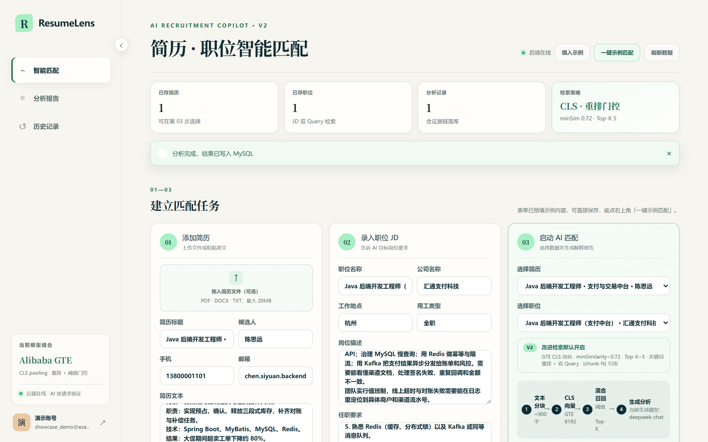
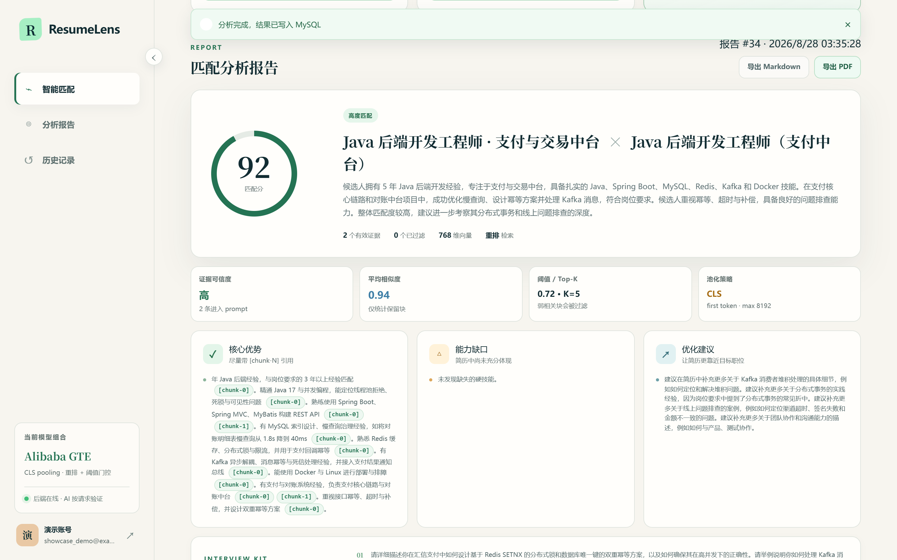
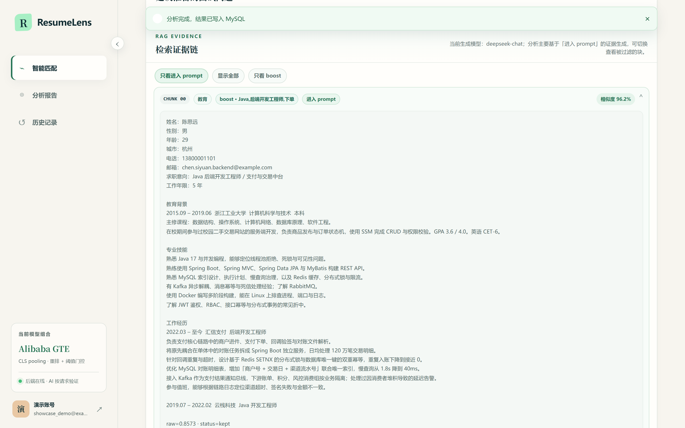
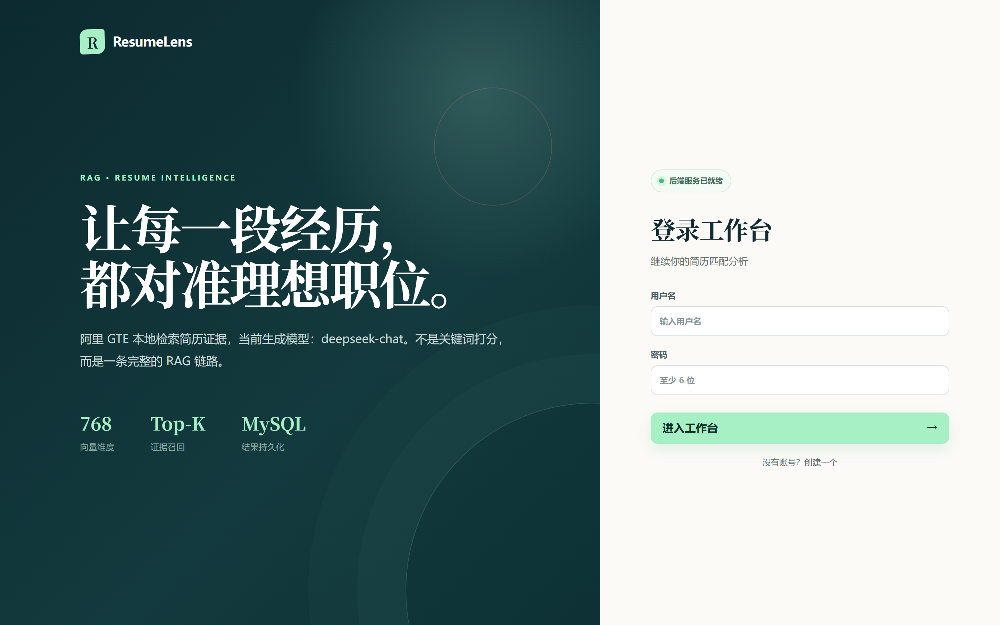
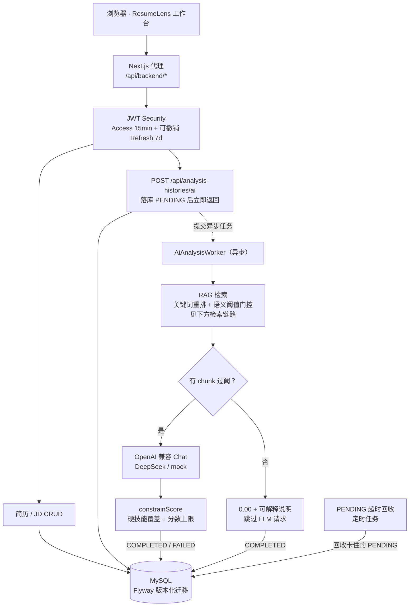
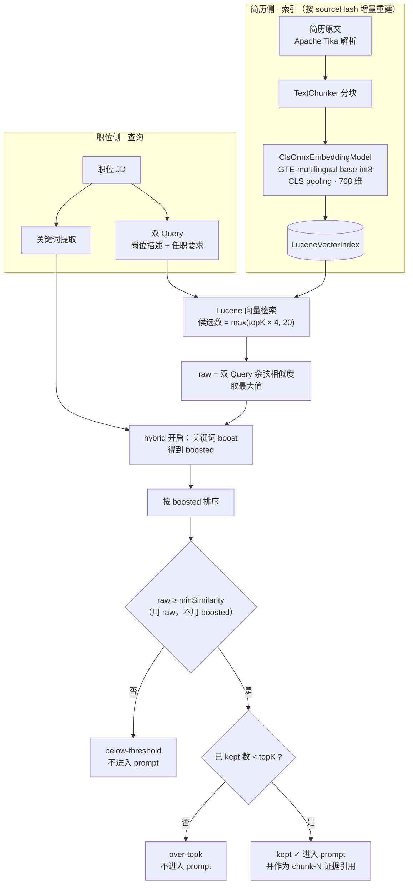

# ResumeLens · JD-RAG Resume Matching

[](https://github.com/wuWhite688/ResumeLens/actions/workflows/ci.yml)

基于 **本地向量检索 + 大模型生成** 的简历 / 职位（JD）智能匹配系统。

后端用 Spring Boot 完成鉴权、持久化、异步分析与「关键词重排 + 语义阈值门控」的 RAG 检索；前端 ResumeLens 工作台覆盖「录入 → 匹配 → 证据链报告 → 导出」完整闭环。适合作为 Java 后端 + RAG 工程化作品集项目。

| 层 | 技术 |
|----|------|
| 后端 | Java 21+ / Spring Boot 3.5 / Spring Security JWT / Spring Data JPA / Flyway / MySQL |
| 解析 | Apache Tika（PDF / DOC / DOCX / TXT） |
| 向量 | 本地 ONNX：`Alibaba-NLP/gte-multilingual-base-int8`（CLS pooling，768 维） |
| 检索 | Lucene 向量索引 + 语义阈值 + 关键词 boost + 双 Query |
| 生成 | OpenAI 兼容 Chat Completions（推荐 DeepSeek；支持 mock） |
| 前端 | Next.js（vinext）/ React 19 / TypeScript |
| 交付 | Docker Compose（MySQL + API + Web）/ Actuator Health |

---

## 界面预览

> 以下截图均由本机真实运行的服务截取（Spring Boot + MySQL + 本地 ONNX 向量检索 + Next.js）。
> 后端以 `AI_MOCK_ENABLED=false` 连接真实 DeepSeek（`deepseek-chat`）运行，**报告正文由真实模型生成**，界面右上角标注了当前生成模型；
> 检索链路同样是真跑的——分块、CLS 向量化、Lucene 召回、相似度与过阈判定都来自真实计算，截图中的 `raw=0.8573 · status=kept` 即真实检索元数据。

**工作台 · 三步建立匹配任务**



**匹配分析报告**：匹配分、证据可信度、平均相似度、当前阈值与 Top-K、池化策略，优势条目直接携带 `[chunk-N]` 引用。



**检索证据链**：每个候选块都展示所属小节、命中的 boost 关键词、是否进入 prompt 以及原始相似度，可按「只看进入 prompt / 显示全部 / 只看 boost」切换——这是本项目对「可解释 RAG」的具体兑现，而不是只给一个分数。



<details>
<summary>登录页与工作台整页长图</summary>



[工作台整页截图](docs/screenshots/03-workbench-full.png)（含表单、报告、证据链与历史记录）

</details>

---

## 功能一览

- **账号**：注册 / 登录、BCrypt 密码、JWT 无状态鉴权、按用户隔离数据；登录/注册有基础频率限制
- **简历**：文本创建或文件上传（每用户最多 30 份、已存文件合计 200MB）、列表检索、编辑、删除（含上传文件与 Lucene 向量清理）
- **职位 JD**：创建、编辑、删除、**JSON 批量导入**（前端入口 + `POST /api/job-descriptions/import`，每用户最多 200 条）
- **BOSS 浏览器扩展**：抓取当前 JD、允许提交前校正、选择已存简历并在扩展内查看分析；按 BOSS 岗位 ID 写入个人岗位库并复用历史结果（见 [`browser-extension/`](browser-extension/)）
- **独立详情页**：`/resumes/[id]`、`/jobs/[id]`（查看 / 编辑 / 删除，复用已有 GET/PUT/DELETE）
- **智能匹配**：异步分析任务（同一简历+JD 的 PENDING 去重；每用户最多 2 条进行中、10 分钟 10 次）；关键词重排 + 语义阈值门控召回证据；硬技能覆盖与服务端分数上限
- **可解释报告**：匹配分、优势 / 缺口 / 建议 / 面试题、chunk 级证据与 `[chunk-N]` 引用
- **导出**：匹配报告 **Markdown** 下载、**PDF**（浏览器打印另存为 PDF，完整中文）
- **可靠性**：PENDING 超时回收、任务队列满保护、解析文本质量校验、列表分页最大 50

---

## 仓库结构

```text
.
├── README.md                      # 本文件（作品集说明）
├── start-mysql.ps1                # 便携 MySQL 启动（参数 / 环境变量 / 自动探测）
├── stop-mysql.ps1
├── connect-mysql.ps1
├── jd-rag-resume-backend/         # Spring Boot API + RAG
│   ├── models/                    # 本地 GTE ONNX + tokenizer（可自动下载）
│   ├── src/main/java/...
│   ├── src/test/java/...
│   └── start-backend-background.ps1
├── jd-rag-resume-frontend/        # ResumeLens 工作台
│   ├── app/page.tsx
│   ├── app/report-export.ts       # 报告 Markdown / PDF 导出
│   └── app/api/backend/[...path]/ # 开发代理 → :8080
└── browser-extension/             # Chrome MV3 · BOSS JD 抓取与岗位库入口
```

本地运行还可能包含 `mysql-9.7.0-winx64/`、`data/` 等**本机数据库文件**，请勿提交到 GitHub。

---

## 架构（主链路）



**检索策略（默认）**

| 参数 | 默认 | 作用 |
|------|------|------|
| `app.rag.min-similarity` | `0.72` | 原始语义相似度门槛（关键词 boost **不能**越过该门槛），由[阈值扫描实验](experiments/threshold-sweep/RESULTS.md)校准，可用 `RAG_MIN_SIMILARITY` 覆盖 |
| `app.rag.top-k` | `5` | 进入 prompt 的最大证据数 |
| `app.rag.hybrid-enabled` | `true` | 关键词小幅 boost，仅重排相关块 |
| `app.rag.dual-query-enabled` | `true` | 职位描述 + 任职要求双 Query |
| pooling | CLS | ONNX `token_embeddings` 取 first token |

**检索链路**



> **为什么阈值判断用 `raw` 而不是 `boosted`**：关键词 boost 的作用只是在**语义已相关**的块之间重排，若用 boosted 过阈，一个仅靠关键词命中、语义无关的块就可能被推进 prompt，污染证据链。因此 boosted 只参与排序，过阈一律以原始语义相似度为准（见 `ResumeRagService#retrieve`）。

无过阈证据时，服务端直接落库 **0.00** 分与可解释说明，并跳过 LLM 请求，既避免「无关简历仍高分」也避免为零证据任务付生成成本。

**阈值 0.72 是怎么定的**

早期版本用的是 0.55，属于凭手感设定。为了给这个数字一个可复核的依据，仓库里有一组阈值扫描实验（[完整报告](experiments/threshold-sweep/RESULTS.md)）：6 份中文简历 × 6 份 JD 组成 18 组配对（对口 / 跨领域 / **同领域但不同方向**各 6 组），走**生产同一条检索路径**——真实 `TextChunker`、真实本地 ONNX embedding、真实 `LuceneVectorIndex`、真实 `ResumeRagService#retrieve`，在 11 个阈值上共 198 次检索（原先 10 个网格点 × 18 对 = 180，补测的 0.72 再加 18），每对的逐块得分都已落盘。

实测的相似度分布（这颗中文 GTE 的余弦整体偏高）：

| 类型 | 块级 raw 区间 |
|---|---|
| 金标相关块 | 最低 **0.751004** |
| 同领域难负块（如 Java 简历 × React JD） | 最高 **0.690011** |

也就是说，**唯一能把两者分开的区间是 (0.690011, 0.751004)，只有 0.061 宽**，而 0.72 取自该区间中点附近。

- **0.55 落在负样本分布内部**：跨领域负样本 0.53–0.65、同领域难负 0.62–0.69，因此 6 组难负配对的证据**全部**漏进 prompt，块级 F1 仅 0.512。
- **0.70 / 0.72 / 0.75 指标完全相同**（块级 F1 0.957、配对级 F1 1.000、金标召回 1.000、负样本与难负样本误放行均为 0），选 0.72 只是因为它离两侧边界都最远。
- **0.80 开始误伤**：金标召回从 1.000 掉到 0.727。

这个实验同时反向验证了上面「用 raw 不用 boosted」的设计——在 0.55 时有 4 个块满足 `raw < 阈值 ≤ boosted`，正是靠这条规则被挡在 prompt 之外的。

> **这组数字的适用范围（重要）**：校准集只有 18 组配对、11 个金标块，且简历与 JD 均为构造文本，**没有独立的 holdout 集**，因此它是一次小规模校准而非严格评测。结论**只对当前的 embedding 模型（`gte-multilingual-base-int8`）与分块配置（`chunkSize=900`/`overlap=120`）成立**——换模型或改分块都必须重跑。阈值本身保持可配置（`RAG_MIN_SIMILARITY` 环境变量），换语料时应当重新校准而不是沿用这个值。

**RAG 消融：短简历为什么还需要检索**

| 对比项 | 全文直投 | RAG（900 / Top-5 / 0.72） |
|---|---:|---:|
| 块级证据 F1 | 0.468 | **0.957** |
| 预计触发 LLM 请求 | 18 | **6（-66.7%）** |
| 负 / 难负证据内容比 | 1.000 | **0.000** |
| 对口短简历证据内容比 | 1.000 | 1.059 |

实验只有 18 组构造配对且没有独立 holdout，也没有调用付费 LLM；证据门控不是端到端匹配准确率，字符数也不是供应商计费 token。结果不支持“RAG 能给对口短简历省 token”，其可测价值是负样本短路、硬技能规则、可追溯 chunk 引用和后续长文档扩展性。

[实验设计与复现](experiments/rag-ablation/README.md) · [完整报告与 48 组参数网格](experiments/rag-ablation/RESULTS.md) · [CSV / JSON 原始结果](experiments/rag-ablation/results/)

---

## 快速启动

### Docker Compose（推荐复现方式）

首次启动前复制环境变量模板，并为数据库应用账号、数据库 root 账号和 JWT 分别填写非空的强随机口令。Compose 会在任一必填值缺失或为空时直接报错退出，不会回退到仓库内的固定口令。默认仍使用离线 AI mock：

```powershell
if (-not (Test-Path compose.env)) { Copy-Item compose.env.example compose.env }
# 编辑 compose.env，填写 DB_PASSWORD、MYSQL_ROOT_PASSWORD、JWT_SECRET
docker compose --env-file compose.env up --build
```

MySQL、后端和前端的宿主端口均仅绑定 `127.0.0.1`。启动后访问 `http://localhost:3000`；后端健康检查为 `http://localhost:8080/actuator/health`。本地 HTTP 请保持 `REFRESH_COOKIE_SECURE=false`（`compose.env.example` 默认如此）；仅当浏览器走 HTTPS 时再改为 `true`。

Compose 的 MySQL 9.7 使用新的 `mysql-9-data` 数据卷，避免把旧版 MySQL 8 的 `mysql-data` 数据目录直接交给 9.7。已有数据不会自动迁移；请保留旧卷，并按 MySQL 官方升级路径或导出/导入方式迁移。

前端通过只读端点 `GET /api/ai/status` 获取当前是否为离线 mock 及模型名，用于如实展示运行模式；该端点不会返回 API Key 或服务地址。

如需真实 DeepSeek，在同一份 `compose.env` 中填写 `AI_API_KEY`，将 `AI_MOCK_ENABLED=false`，再运行：

```powershell
docker compose --env-file compose.env up --build
```

以下是不用 Docker 时的手动启动方式。

### 前置条件

- **JDK 21+**（本机曾用 JDK 25 验证；`pom.xml` 声明 `java.version=21`）
- **Maven Wrapper**（仓库自带 `mvnw` / `mvnw.cmd`）
- **MySQL 8+/9**，库名 `jd_rag_resume`
- **环境变量**：`DB_PASSWORD`、`JWT_SECRET`（至少 32 字节）必须设置，后端不会使用仓库内默认口令
- **Node.js ≥ 22.13**
- （可选）LLM：`AI_API_KEY` / `AI_BASE_URL` / `AI_MODEL`；或 `AI_MOCK_ENABLED=true` 做离线演示

### 1. 数据库

创建库与用户（示例，口令请换成你自己的强随机值，并与 `DB_PASSWORD` 一致）：

```sql
CREATE DATABASE IF NOT EXISTS jd_rag_resume
  DEFAULT CHARACTER SET utf8mb4 COLLATE utf8mb4_unicode_ci;
CREATE USER IF NOT EXISTS 'jd_app'@'%' IDENTIFIED BY 'your-db-password';
GRANT ALL PRIVILEGES ON jd_rag_resume.* TO 'jd_app'@'%';
FLUSH PRIVILEGES;
```

若使用本仓库附带的便携 MySQL 脚本：

```powershell
.\start-mysql.ps1
.\connect-mysql.ps1
```

路径按此顺序解析：参数 `-MysqlBaseDir` / `-MysqlDataDir`，环境变量 `RESUMELENS_MYSQL_HOME` / `RESUMELENS_MYSQL_DATA`，然后自动探测仓库内 `mysql-*-winx64` + `data\`，或 `C:\tmp\mysql-*-winx64` + `C:\tmp\mysql-*-data`。`basedir` 与 `datadir` 必须成对匹配；找不到会报错并列出已检查位置。

### 2. 后端

```powershell
cd jd-rag-resume-backend

$env:DB_PASSWORD = "your-db-password"
$env:JWT_SECRET = "replace-with-at-least-32-byte-random-secret"

# 可选：真实 LLM
$env:AI_API_KEY = "sk-..."
$env:AI_BASE_URL = "https://api.deepseek.com"
$env:AI_MODEL = "deepseek-chat"

# 或 mock
$env:AI_MOCK_ENABLED = "true"

.\mvnw.cmd clean package -DskipTests
.\start-backend-background.ps1
# 健康检查：http://127.0.0.1:8080/actuator/health
```

启动脚本会依次从显式的 `-JavaPath`、`JAVA_HOME`、`PATH` 查找 `java.exe`；需要指定独立 JDK 时可运行 `.\start-backend-background.ps1 -JavaPath 'D:\Java\jdk-21\bin\java.exe'`。

首次启动会加载 `models/gte-multilingual-base-int8/`；若缺失，启动脚本会从固定的 Hugging Face revision `2edbf5e672aab465f9ed4c154a8b61791c082c69` 下载 tokenizer 与 ONNX 模型，并在落盘前校验 SHA256。已有文件若校验不通过，脚本会拒绝启动并提示删除后重新下载（不会自行删除该文件），避免模型静默漂移导致检索结果与已校准的阈值不再对应。

运行测试：

```powershell
.\mvnw.cmd test
# 可选真实 embedding 回归（需下载模型，较慢）
$env:RUN_EMBEDDING_REGRESSION = "true"
.\mvnw.cmd -Dtest=RealEmbeddingRegressionTests test
```

`ResumeDeleteCascadeMySqlTests` 使用 Testcontainers 启动真实的 `mysql:9.7.0`。Docker 不可用时，这 2 项测试会被跳过；因此 Windows 下 `.\mvnw.cmd test` 显示 `BUILD SUCCESS` 不代表级联删除已经验证，控制台会额外打印醒目的 `ResumeDeleteCascadeMySqlTests SKIPPED` 警告。

本机 Docker 运行在 WSL 时，请从 PowerShell 进入后端目录并切换到同一目录的 WSL shell：

```powershell
Set-Location jd-rag-resume-backend
wsl.exe -d Ubuntu --cd "$PWD"
```

WSL 内需安装 JDK 21+。以下命令使用 WSL 的 `/var/run/docker.sock`，不会开放 Docker TCP 端口，也不需要设置 `DOCKER_HOST`：

```bash
export HTTP_PROXY="${HTTP_PROXY:-http://127.0.0.1:7897}"
export HTTPS_PROXY="${HTTPS_PROXY:-$HTTP_PROXY}"
export NO_PROXY="${NO_PROXY:-localhost,127.0.0.1}"

# 首次配置，让当前用户可访问 Docker Unix socket
sudo usermod -aG docker "$USER"

if ! sudo docker info >/dev/null 2>&1; then
  sudo env HTTP_PROXY="$HTTP_PROXY" HTTPS_PROXY="$HTTPS_PROXY" NO_PROXY="$NO_PROXY" \
    sh -c 'nohup dockerd >/tmp/resumelens-dockerd.log 2>&1 &'
  for _ in $(seq 1 30); do
    sudo docker info >/dev/null 2>&1 && break
    sleep 1
  done
fi

sudo docker info >/dev/null
sg docker -c './mvnw test'
```

完整验收应看到 `ResumeDeleteCascadeMySqlTests` 为 `Tests run: 2, Failures: 0, Errors: 0, Skipped: 0`（两条 MySQL 级联用例都真实执行），总汇总为 `Failures: 0, Errors: 0`。默认跳过项只应来自显式门控的真实 embedding 回归（`RUN_EMBEDDING_REGRESSION`）、两条阈值扫描实验（`RUN_THRESHOLD_SWEEP_PREVIEW` / `RUN_THRESHOLD_SWEEP`）和 RAG 消融实验（`RUN_RAG_ABLATION`）。

用例总数会随测试增补而变化，因此这里不写死具体数字 —— 验收依据是 `Skipped` 的**构成**，而不是总数。

### 3. 前端

```powershell
cd jd-rag-resume-frontend
npm install
# 可选：自定义后端地址（默认 http://127.0.0.1:8080）
$env:BACKEND_API_URL = "http://127.0.0.1:8080"
npm run dev
```

浏览器打开开发服务器提示的地址，注册账号后即可使用。

前端测试：

```powershell
npm test
# 或单独跑报告导出单测
node --experimental-strip-types --test tests/report-export.test.ts
```

---

## 主要 HTTP API

除 `/api/auth/**` 外均需 `Authorization: Bearer <accessToken>`。

| 方法 | 路径 | 说明 |
|------|------|------|
| POST | `/api/auth/register` | 注册（经 BFF 识别的客户端 IP 有频率限制；用户名/邮箱冲突返回同一错误码，409） |
| POST | `/api/auth/login` | 登录，返回 JWT（经 BFF 识别的客户端 IP+用户名有频率限制） |
| GET/PUT | `/api/users/me` | 当前用户 |
| GET/POST | `/api/resumes` | 列表（不含 `rawText`，`size` 最大 50）/ 文本创建 |
| POST | `/api/resumes/upload` | multipart 上传（计入 30 份 / 200MB 配额） |
| GET/PUT/DELETE | `/api/resumes/{id}` | 详情（含 `rawText`）/ 更新 / 删除 |
| GET/POST | `/api/job-descriptions` | 列表（`size` 最大 50）/ 创建 |
| POST | `/api/job-descriptions/import` | 批量导入（单次最多 50 条，计入 200 条配额）|
| GET/PUT/DELETE | `/api/job-descriptions/{id}` | 详情 / 更新 / 删除 |
| POST | `/api/analysis-histories/ai` | 异步启动 AI 匹配（立即返回 PENDING；超限 429） |
| GET | `/api/analysis-histories` / `{id}` | 历史与轮询（列表 `size` 最大 50） |
| PUT/DELETE | `/api/analysis-histories/{id}` | 更新 / 删除记录 |

统一响应：`{ success, code, message, data }`。

---

## 配置要点

文件：`jd-rag-resume-backend/src/main/resources/application.properties`

| 配置 | 说明 |
|------|------|
| `spring.datasource.*` | MySQL 连接（**本地开发明文，上线请外置**） |
| `spring.flyway.*` | V1 初始化迁移；旧 Hibernate 数据库首次接入时自动 baseline，不改历史数据 |
| `app.jwt.secret` | JWT 密钥（**上线必须更换**） |
| `app.jwt.expiration-minutes` | 默认 15 |
| `app.jwt.refresh-cookie-secure` | 默认 `false`，保证本地 HTTP 可登录；HTTPS 请设 `true` |
| `ai.*` / 环境变量 | LLM 或 mock |
| `app.rag.*` | 分块、Top-K、语义阈值、关键词重排、模型 URI、Lucene 目录 |
| `app.analysis.pending-timeout-minutes` | 卡住的 PENDING 回收阈值 |
| `app.analysis.max-pending-per-user` | 默认 2 |
| `app.analysis.max-submits-per-window` | 默认 10 次 / 10 分钟 |
| `app.upload.max-resumes-per-user` | 默认 30 |
| `app.upload.max-stored-bytes-per-user` | 默认 200MB |
| `app.job-description.max-per-user` | 默认 200 |

**安全提示**：当前配置面向本地演示；公开仓库前请移除真实密钥，改用环境变量或外部配置。BFF 会覆盖 `X-BFF-Client-IP`，后端只信任 loopback/私有服务网来源，因此部署时不要绕过 BFF 将后端直接暴露到公网。

---

## 作品集演示建议

1. 注册账号 → 「一键示例匹配」走通异步分析与证据链  
2. 打开报告：查看 kept / filtered、相似度、硬技能相关缺口  
3. **导出 Markdown / PDF**，展示可交付物  
4. 编辑 / 删除简历或 JD，再重新匹配，体现 CRUD 与索引失效重建  
5. （可选）用一份无关领域简历对比，说明阈值与 0 分兜底  

---

## 已知边界（诚实说明）

- 主工作台仍为单页（锚点导航），并已增加简历/JD **独立详情路由**  
- UI 通过 Actuator 实时探测**后端健康**；DeepSeek / 兼容模型是否可用仍以实际分析请求为准  
- 旧的 Hibernate 建表数据库会由 Flyway baseline 为 V1；新数据库直接执行版本化迁移  
- Compose 首次启动需下载本地 GTE 模型，耗时取决于网络  
- `RealEmbeddingRegressionTests` 与实验型 `ThresholdSweepExperimentTests` 默认跳过，需环境变量开启（`RUN_EMBEDDING_REGRESSION` / `RUN_THRESHOLD_SWEEP_PREVIEW` / `RUN_THRESHOLD_SWEEP` / `RUN_RAG_ABLATION`）

这些不影响主链路演示；公开部署前仍应继续做密钥外置与运行环境加固。

---

## License

个人学习 / 作品集项目。第三方模型权重与依赖遵循其各自许可证（Alibaba GTE ONNX、Spring、Lucene、Tika 等）。
