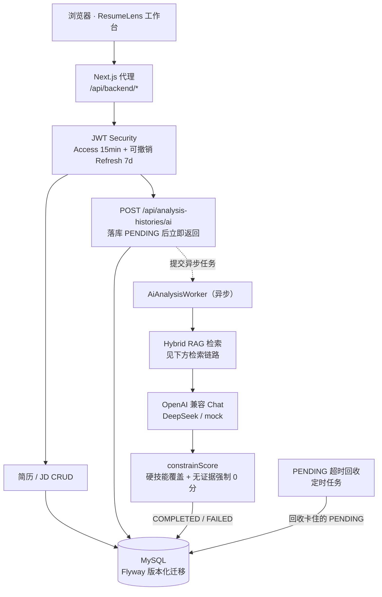
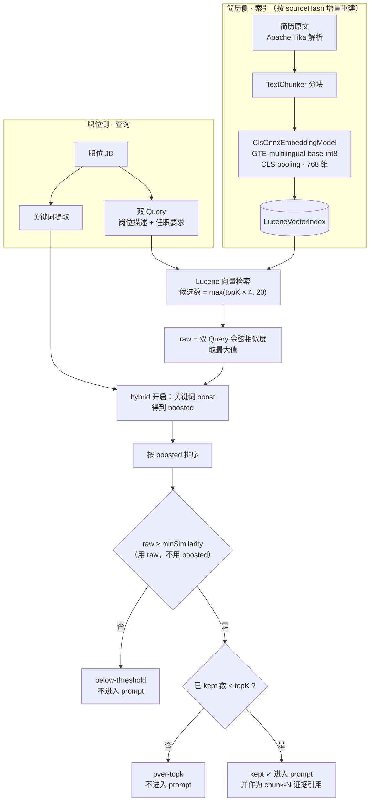

# ResumeLens · JD-RAG Resume Matching

基于 **本地向量检索 + 大模型生成** 的简历 / 职位（JD）智能匹配系统。

后端用 Spring Boot 完成鉴权、持久化、异步分析与 Hybrid RAG；前端 ResumeLens 工作台覆盖「录入 → 匹配 → 证据链报告 → 导出」完整闭环。适合作为 Java 后端 + RAG 工程化作品集项目。

| 层 | 技术 |
|----|------|
| 后端 | Java 21+ / Spring Boot 3.5 / Spring Security JWT / Spring Data JPA / Flyway / MySQL |
| 解析 | Apache Tika（PDF / DOC / DOCX / TXT） |
| 向量 | 本地 ONNX：`Alibaba-NLP/gte-multilingual-base-int8`（CLS pooling，768 维） |
| 检索 | Lucene 向量索引 + 语义阈值 + 关键词 boost + 双 Query |
| 生成 | OpenAI 兼容 Chat Completions（推荐 DeepSeek；支持 mock） |
| 前端 | Next.js（vinext）/ React 19 / TypeScript |
| 交付 | Docker Compose（MySQL + API + Web）/ Actuator Health |

---

## 功能一览

- **账号**：注册 / 登录、BCrypt 密码、JWT 无状态鉴权、按用户隔离数据
- **简历**：文本创建或文件上传、列表检索、编辑、删除（含上传文件与 Lucene 向量清理）
- **职位 JD**：创建、编辑、删除、**JSON 批量导入**（前端入口 + `POST /api/job-descriptions/import`）
- **独立详情页**：`/resumes/[id]`、`/jobs/[id]`（查看 / 编辑 / 删除，复用已有 GET/PUT/DELETE）
- **智能匹配**：异步分析任务；Hybrid RAG 召回证据；硬技能覆盖与服务端分数上限
- **可解释报告**：匹配分、优势 / 缺口 / 建议 / 面试题、chunk 级证据与 `[chunk-N]` 引用
- **导出**：匹配报告 **Markdown** 下载、**PDF**（浏览器打印另存为 PDF，完整中文）
- **可靠性**：PENDING 超时回收、任务队列满保护、解析文本质量校验

---

## 仓库结构

```text
.
├── README.md                      # 本文件（作品集说明）
├── start-mysql.ps1                # 本地 MySQL 启动（便携包路径见脚本）
├── stop-mysql.ps1
├── connect-mysql.ps1
├── jd-rag-resume-backend/         # Spring Boot API + RAG
│   ├── models/                    # 本地 GTE ONNX + tokenizer（可自动下载）
│   ├── src/main/java/...
│   ├── src/test/java/...
│   └── start-backend-background.ps1
└── jd-rag-resume-frontend/        # ResumeLens 工作台
    ├── app/page.tsx
    ├── app/report-export.ts       # 报告 Markdown / PDF 导出
    └── app/api/backend/[...path]/ # 开发代理 → :8080
```

本地运行还可能包含 `mysql-9.7.0-winx64/`、`data/` 等**本机数据库文件**，请勿提交到 GitHub。

---

## 架构（主链路）



**检索策略（默认）**

| 参数 | 默认 | 作用 |
|------|------|------|
| `app.rag.min-similarity` | `0.55` | 原始语义相似度门槛（关键词 boost **不能**越过该门槛） |
| `app.rag.top-k` | `5` | 进入 prompt 的最大证据数 |
| `app.rag.hybrid-enabled` | `true` | 关键词小幅 boost，仅重排相关块 |
| `app.rag.dual-query-enabled` | `true` | 职位描述 + 任职要求双 Query |
| pooling | CLS | ONNX `token_embeddings` 取 first token |

**检索链路**



> **为什么阈值判断用 `raw` 而不是 `boosted`**：关键词 boost 的作用只是在**语义已相关**的块之间重排，若用 boosted 过阈，一个仅靠关键词命中、语义无关的块就可能被推进 prompt，污染证据链。因此 boosted 只参与排序，过阈一律以原始语义相似度为准（见 `ResumeRagService#retrieve`）。

无过阈证据时，服务端强制匹配分为 **0.00**，避免「无关简历仍高分」。

---

## 快速启动

### Docker Compose（推荐复现方式）

默认使用离线 AI mock，首次启动会下载 Maven / npm 依赖与本地 GTE 模型：

```powershell
docker compose up --build
```

启动后访问 `http://localhost:3000`；后端健康检查为 `http://localhost:8080/actuator/health`。

前端通过只读端点 `GET /api/ai/status` 获取当前是否为离线 mock 及模型名，用于如实展示运行模式；该端点不会返回 API Key 或服务地址。

如需真实 DeepSeek，复制 `compose.env.example` 为 `compose.env`，填写密钥并将 `AI_MOCK_ENABLED=false`，再运行：

```powershell
docker compose --env-file compose.env up --build
```

以下是不用 Docker 时的手动启动方式。

### 前置条件

- **JDK 21+**（本机曾用 JDK 25 验证；`pom.xml` 声明 `java.version=21`）
- **Maven Wrapper**（仓库自带 `mvnw` / `mvnw.cmd`）
- **MySQL 8+/9**，库名 `jd_rag_resume`，应用账号默认见配置
- **Node.js ≥ 22.13**
- （可选）LLM：`AI_API_KEY` / `AI_BASE_URL` / `AI_MODEL`；或 `AI_MOCK_ENABLED=true` 做离线演示

### 1. 数据库

创建库与用户（示例，与 `application.properties` 一致）：

```sql
CREATE DATABASE IF NOT EXISTS jd_rag_resume
  DEFAULT CHARACTER SET utf8mb4 COLLATE utf8mb4_unicode_ci;
CREATE USER IF NOT EXISTS 'jd_app'@'%' IDENTIFIED BY 'jd_app_123456';
GRANT ALL PRIVILEGES ON jd_rag_resume.* TO 'jd_app'@'%';
FLUSH PRIVILEGES;
```

若使用本仓库附带的便携 MySQL 脚本，请按你机器上的 `start-mysql.ps1` 路径启动（脚本内 `basedir` / `datadir` 需与本机一致）。

### 2. 后端

```powershell
cd jd-rag-resume-backend

# 可选：真实 LLM
$env:AI_API_KEY = "sk-..."
$env:AI_BASE_URL = "https://api.deepseek.com"
$env:AI_MODEL = "deepseek-chat"

# 或 mock
$env:AI_MOCK_ENABLED = "true"

.\mvnw.cmd clean package -DskipTests
.\start-backend-background.ps1
# 健康检查：http://127.0.0.1:8080/actuator/health
```

首次启动会加载 `models/gte-multilingual-base-int8/`；若缺失，启动脚本会尝试下载 tokenizer 与 ONNX 模型。

运行测试：

```powershell
.\mvnw.cmd test
# 可选真实 embedding 回归（需下载模型，较慢）
$env:RUN_EMBEDDING_REGRESSION = "true"
.\mvnw.cmd -Dtest=RealEmbeddingRegressionTests test
```

`ResumeDeleteCascadeMySqlTests` 使用 Testcontainers 启动真实的 `mysql:9.7.0`。Docker 不可用时，这 2 项测试会被跳过；因此 Windows 下 `.\mvnw.cmd test` 显示 `BUILD SUCCESS` 不代表级联删除已经验证，控制台会额外打印醒目的 `ResumeDeleteCascadeMySqlTests SKIPPED` 警告。

本机 Docker 运行在 WSL 时，请从 PowerShell 进入后端目录并切换到同一目录的 WSL shell：

```powershell
Set-Location jd-rag-resume-backend
wsl.exe -d Ubuntu --cd "$PWD"
```

WSL 内需安装 JDK 21+。以下命令使用 WSL 的 `/var/run/docker.sock`，不会开放 Docker TCP 端口，也不需要设置 `DOCKER_HOST`：

```bash
export HTTP_PROXY="${HTTP_PROXY:-http://127.0.0.1:7897}"
export HTTPS_PROXY="${HTTPS_PROXY:-$HTTP_PROXY}"
export NO_PROXY="${NO_PROXY:-localhost,127.0.0.1}"

# 首次配置，让当前用户可访问 Docker Unix socket
sudo usermod -aG docker "$USER"

if ! sudo docker info >/dev/null 2>&1; then
  sudo env HTTP_PROXY="$HTTP_PROXY" HTTPS_PROXY="$HTTPS_PROXY" NO_PROXY="$NO_PROXY" \
    sh -c 'nohup dockerd >/tmp/resumelens-dockerd.log 2>&1 &'
  for _ in $(seq 1 30); do
    sudo docker info >/dev/null 2>&1 && break
    sleep 1
  done
fi

sudo docker info >/dev/null
sg docker -c './mvnw test'
```

完整验收应看到 `ResumeDeleteCascadeMySqlTests` 为 `Tests run: 2, Failures: 0, Errors: 0, Skipped: 0`，总汇总为 `Tests run: 28, Failures: 0, Errors: 0, Skipped: 1`（仅跳过真实 embedding 回归）。

### 3. 前端

```powershell
cd jd-rag-resume-frontend
npm install
# 可选：自定义后端地址（默认 http://127.0.0.1:8080）
$env:BACKEND_API_URL = "http://127.0.0.1:8080"
npm run dev
```

浏览器打开开发服务器提示的地址，注册账号后即可使用。

前端测试：

```powershell
npm test
# 或单独跑报告导出单测
node --experimental-strip-types --test tests/report-export.test.ts
```

---

## 主要 HTTP API

除 `/api/auth/**` 外均需 `Authorization: Bearer <accessToken>`。

| 方法 | 路径 | 说明 |
|------|------|------|
| POST | `/api/auth/register` | 注册 |
| POST | `/api/auth/login` | 登录，返回 JWT |
| GET/PUT | `/api/users/me` | 当前用户 |
| GET/POST | `/api/resumes` | 列表 / 文本创建 |
| POST | `/api/resumes/upload` | multipart 上传 |
| GET/PUT/DELETE | `/api/resumes/{id}` | 详情 / 更新 / 删除 |
| GET/POST | `/api/job-descriptions` | 列表 / 创建 |
| POST | `/api/job-descriptions/import` | 批量导入 |
| GET/PUT/DELETE | `/api/job-descriptions/{id}` | 详情 / 更新 / 删除 |
| POST | `/api/analysis-histories/ai` | 异步启动 AI 匹配（立即返回 PENDING） |
| GET | `/api/analysis-histories` / `{id}` | 历史与轮询 |
| PUT/DELETE | `/api/analysis-histories/{id}` | 更新 / 删除记录 |

统一响应：`{ success, code, message, data }`。

---

## 配置要点

文件：`jd-rag-resume-backend/src/main/resources/application.properties`

| 配置 | 说明 |
|------|------|
| `spring.datasource.*` | MySQL 连接（**本地开发明文，上线请外置**） |
| `spring.flyway.*` | V1 初始化迁移；旧 Hibernate 数据库首次接入时自动 baseline，不改历史数据 |
| `app.jwt.secret` | JWT 密钥（**上线必须更换**） |
| `app.jwt.expiration-minutes` | 默认 1440 |
| `ai.*` / 环境变量 | LLM 或 mock |
| `app.rag.*` | 分块、Top-K、阈值、Hybrid、模型 URI、Lucene 目录 |
| `app.analysis.pending-timeout-minutes` | 卡住的 PENDING 回收阈值 |

**安全提示**：当前配置面向本地演示；公开仓库前请移除真实密钥，改用环境变量或外部配置。

---

## 作品集演示建议

1. 注册账号 → 「一键示例匹配」走通异步分析与证据链  
2. 打开报告：查看 kept / filtered、相似度、硬技能相关缺口  
3. **导出 Markdown / PDF**，展示可交付物  
4. 编辑 / 删除简历或 JD，再重新匹配，体现 CRUD 与索引失效重建  
5. （可选）用一份无关领域简历对比，说明阈值与 0 分兜底  

---

## 已知边界（诚实说明）

- 主工作台仍为单页（锚点导航），并已增加简历/JD **独立详情路由**  
- UI 通过 Actuator 实时探测**后端健康**；DeepSeek / 兼容模型是否可用仍以实际分析请求为准  
- 旧的 Hibernate 建表数据库会由 Flyway baseline 为 V1；新数据库直接执行版本化迁移  
- Compose 首次启动需下载本地 GTE 模型，耗时取决于网络  
- `RealEmbeddingRegressionTests` 默认跳过，需环境变量开启  

这些不影响主链路演示；公开部署前仍应继续做密钥外置与运行环境加固。

---

## License

个人学习 / 作品集项目。第三方模型权重与依赖遵循其各自许可证（Alibaba GTE ONNX、Spring、Lucene、Tika 等）。
